# Summary
Creating logo images using Generative Adversarial Networks (GANs).

This project uses GANs models to produce new logo images. It works by trying to mimic real-world images collected from the Wikipedia pages. More details about GANs are provided in the overview.

Also, bellow is specified OS and Hardware elements used during this project R&D, explanation of the used dataset, results in section and analysis section. In the result section, most of the documentation consists of cases in which models were trained. Those cases consist of conclusions, generator samples on arbitrarily chosen epochs, and generator accuracy for that case. These cases are intended to give more intuition on how GANs tries to solve the given problem. In the analysis section, more details graphics are provided in order to get better intuition about what happening during the training process.

## GANs overview
Generative Adversarial Networks (GANs) belongs to the generative models. That means they are able to generate artificial content base on the arbitrary input.

Generally, GANs most of the time refers to the training method, rather on the generative model. Reason for this is that GANs don't train a single network, but instead two networks simultaneously.

The first network is usually called Generator, while the second Discriminator. Purpose of the Generator model is to images that look real. During training, the Generator progressively becomes better at creating images that look real. Purpose of the Discriminator model is to learn to tell real images apart from fakes. During training, the Discriminator progressively becomes better at telling fake images from real ones. The process reaches equilibrium when the Discriminator can no longer distinguish real images from fakes.

## Environment
- **OS:** Ubuntu 19.04
- **Processor:** Intel Core i7-4770 CPU @ 3.40GHz × 8
- **Graphics:** GeForce GTX 1080 Ti/PCIe/SSE2
- **Memory:** Kingston HyperX Fury Red 16 GB (2 x 8 GB)
- **Language:** Python 3.5.2 with TensorFlow 2.0.0b1 (Dockerized version)

## Dataset
The dataset used for generating logo images comes from [Large Logo Dataset (LLD)](https://data.vision.ee.ethz.ch/sagea/lld/). Concretely, from a [sample of 5.000 images](https://data.vision.ee.ethz.ch/sagea/lld/data/LLD-icon_sample.zip) in the PNG format. Shape of images is 32x32x3, where they represent Width, Height and Channels respectively. Images are collected from the Wikipedia descriptions by looking for favicon.ico sample.

## Notes
- The last **Case 3** is still in the training process. Presented results are only current results. This case will last at least 500.000 epoch. If it start to generate good results, this could be prolonged to even more epochs.

# Results

## Case 1
This case uses the whole dataset that contains **5.000** logo samples. It iterates over **230.000** epochs with **256** batch size. The total execution time of this case is **6d 10h 39m 59s**.

As you can see, the generator model tries to generate real-looking logo images by mimic the value and distribution of the pixels of each image batch. Generator model converges well until 167.000 epoch. Then, it overfits to the one combination of samples and generates a very similar image each time. This maybe could be solved by longer training or/and bigger dataset, but this requires additional hardware resource in order to speed up the training process. From the discriminator perspective, it does very well in determining which images are real, and which are fake with almost 100% accuracy. 

### Generator Results
<table>
	<tr>
		<td></td>
		<td>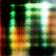</td>
		<td>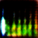</td>
		<td></td>
		<td></td>
		<td></td>
		<td></td>
		<td></td>
		<td></td>
		<td></td>
		<td>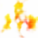</td>
		<td></td>
	</tr>
	<tr>
		<td></td>
		<td></td>
		<td></td>
		<td></td>
		<td></td>
		<td></td>
		<td></td>
		<td></td>
		<td></td>
		<td></td>
		<td></td>
		<td></td>
	</tr>
	<tr>
		<td></td>
		<td></td>
		<td></td>
		<td></td>
		<td></td>
		<td></td>
		<td></td>
		<td></td>
		<td></td>
		<td></td>
		<td></td>
		<td></td>
	</tr>
	<tr>
		<td></td>
		<td></td>
		<td></td>
		<td></td>
		<td></td>
		<td></td>
		<td></td>
		<td></td>
		<td></td>
		<td></td>
		<td></td>
		<td></td>
	</tr>
	<tr>
		<td></td>
		<td></td>
		<td></td>
		<td></td>
		<td></td>
		<td></td>
		<td></td>
		<td></td>
		<td></td>
		<td></td>
		<td></td>
		<td></td>
	</tr>
	<tr>
		<td></td>
		<td></td>
		<td></td>
		<td></td>
		<td></td>
		<td></td>
		<td></td>
		<td></td>
		<td></td>
		<td></td>
		<td></td>
		<td></td>
	</tr>
	<tr>
		<td></td>
		<td></td>
		<td></td>
		<td></td>
		<td></td>
		<td></td>
		<td></td>
		<td></td>
		<td></td>
		<td></td>
		<td></td>
		<td></td>
	</tr>
	<tr>
		<td></td>
		<td></td>
		<td></td>
		<td></td>
		<td></td>
		<td></td>
		<td></td>
		<td></td>
		<td></td>
		<td></td>
		<td></td>
		<td>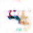</td>
	</tr>
	<tr>
		<td>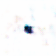</td>
		<td>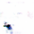</td>
		<td></td>
		<td></td>
		<td></td>
		<td></td>
		<td></td>
		<td></td>
		<td></td>
		<td></td>
		<td>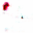</td>
		<td></td>
	</tr>
	<tr>
		<td></td>
		<td></td>
		<td></td>
		<td></td>
		<td></td>
		<td></td>
		<td>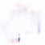</td>
		<td></td>
		<td></td>
		<td></td>
		<td></td>
		<td></td>
	</tr>
	<tr>
		<td></td>
		<td></td>
		<td></td>
		<td></td>
		<td></td>
		<td></td>
		<td>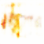</td>
		<td></td>
		<td></td>
		<td></td>
		<td></td>
		<td></td>
	</tr>
	<tr>
		<td></td>
		<td></td>
		<td></td>
		<td></td>
		<td>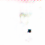</td>
		<td></td>
		<td></td>
		<td></td>
		<td></td>
		<td></td>
		<td></td>
		<td></td>
	</tr>
	<tr>
		<td></td>
		<td></td>
		<td></td>
		<td></td>
		<td></td>
		<td></td>
		<td>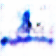</td>
		<td></td>
		<td></td>
		<td></td>
		<td></td>
		<td></td>
	</tr>
	<tr>
		<td>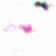</td>
		<td></td>
		<td></td>
		<td></td>
		<td>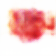</td>
		<td>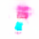</td>
		<td></td>
		<td></td>
		<td></td>
		<td></td>
		<td>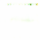</td>
		<td></td>
	</tr>
	<tr>
		<td></td>
		<td></td>
		<td></td>
		<td></td>
		<td></td>
		<td></td>
		<td></td>
		<td></td>
		<td></td>
		<td></td>
		<td></td>
		<td></td>
	</tr>
	<tr>
		<td></td>
		<td></td>
		<td></td>
		<td></td>
		<td></td>
		<td></td>
		<td></td>
		<td></td>
		<td></td>
		<td></td>
		<td></td>
		<td></td>
	</tr>
	<tr>
		<td></td>
		<td></td>
		<td></td>
		<td></td>
		<td></td>
		<td></td>
		<td></td>
		<td></td>
		<td></td>
		<td></td>
		<td></td>
		<td></td>
	</tr>
	<tr>
		<td></td>
		<td></td>
		<td></td>
		<td></td>
		<td></td>
		<td></td>
		<td></td>
		<td></td>
		<td></td>
		<td></td>
		<td></td>
		<td></td>
	</tr>
	<tr>
		<td></td>
		<td></td>
		<td></td>
		<td></td>
		<td></td>
		<td></td>
		<td></td>
		<td></td>
		<td></td>
		<td></td>
		<td></td>
		<td></td>
	</tr>
	<tr>
		<td></td>
		<td></td>
		<td></td>
		<td></td>
		<td></td>
		<td></td>
		<td></td>
		<td></td>
		<td></td>
		<td></td>
		<td></td>
		<td></td>
	</tr>
	<tr>
		<td></td>
		<td></td>
		<td></td>
		<td></td>
		<td></td>
		<td></td>
		<td></td>
		<td></td>
		<td></td>
	</tr>
</table>

### Discriminator Accuracy
<table>
    <tr>
        <td>Discriminator on real images</td>
    </tr>
    <tr>
        <td></td>
    </tr>
    <tr>
        <td>Discriminator on fake images</td>
    </tr>
    <tr>
        <td></td>
    </tr>
    <tr>
        <td>Discriminator combined mean loss</td>
    </tr>
    <tr>
        <td></td>
    </tr>
</table>

## Case 2
This case uses a small part of the dataset that contains **100** logo samples. It iterates over **760.000** epochs with **100** batch size. The total execution time of this case is **1d 15h 3m 19s**.

Because of the very tiny dataset size, generator, in this case, overfits really fast. At 32.000 epoch, it already overfits and generates logo samples from the dataset. Till the end of the training, it keeps generating images too much similar to the training ones. Discriminator does very well in this case too, with almost 100% accuracy.

In the generator results, only images till 201.000 epoch are shown. Rest of the samples are similar till 760.000 epochs.

### Generator Results
<table>
	<tr>
		<td></td>
		<td></td>
		<td>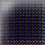</td>
		<td>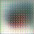</td>
		<td>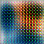</td>
		<td>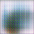</td>
		<td>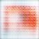</td>
		<td>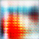</td>
		<td></td>
		<td></td>
		<td></td>
		<td></td>
	</tr>
	<tr>
		<td></td>
		<td></td>
		<td></td>
		<td></td>
		<td></td>
		<td></td>
		<td></td>
		<td></td>
		<td></td>
		<td>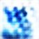</td>
		<td></td>
		<td></td>
	</tr>
	<tr>
		<td>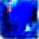</td>
		<td></td>
		<td></td>
		<td></td>
		<td></td>
		<td></td>
		<td></td>
		<td></td>
		<td></td>
		<td></td>
		<td></td>
		<td></td>
	</tr>
	<tr>
		<td></td>
		<td></td>
		<td></td>
		<td></td>
		<td></td>
		<td></td>
		<td></td>
		<td></td>
		<td></td>
		<td></td>
		<td></td>
		<td></td>
	</tr>
	<tr>
		<td></td>
		<td></td>
		<td></td>
		<td></td>
		<td></td>
		<td></td>
		<td></td>
		<td></td>
		<td></td>
		<td></td>
		<td></td>
		<td></td>
	</tr>
	<tr>
		<td></td>
		<td></td>
		<td></td>
		<td></td>
		<td></td>
		<td></td>
		<td></td>
		<td></td>
		<td></td>
		<td></td>
		<td></td>
		<td></td>
	</tr>
	<tr>
		<td></td>
		<td></td>
		<td></td>
		<td></td>
		<td></td>
		<td></td>
		<td></td>
		<td></td>
		<td></td>
		<td></td>
		<td></td>
		<td></td>
	</tr>
	<tr>
		<td></td>
		<td></td>
		<td></td>
		<td></td>
		<td></td>
		<td></td>
		<td></td>
		<td></td>
		<td></td>
		<td></td>
		<td></td>
		<td></td>
	</tr>
	<tr>
		<td></td>
		<td>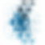</td>
		<td></td>
		<td></td>
		<td></td>
		<td></td>
		<td></td>
		<td></td>
		<td></td>
		<td></td>
		<td></td>
		<td></td>
	</tr>
	<tr>
		<td></td>
		<td></td>
		<td></td>
		<td></td>
		<td></td>
		<td>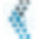</td>
		<td></td>
		<td></td>
		<td></td>
		<td></td>
		<td>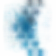</td>
		<td></td>
	</tr>
	<tr>
		<td></td>
		<td></td>
		<td></td>
		<td></td>
		<td></td>
		<td></td>
		<td></td>
		<td></td>
		<td></td>
		<td></td>
		<td></td>
		<td></td>
	</tr>
	<tr>
		<td></td>
		<td></td>
		<td></td>
		<td></td>
		<td></td>
		<td></td>
		<td></td>
		<td></td>
		<td></td>
		<td></td>
		<td>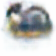</td>
		<td></td>
	</tr>
	<tr>
		<td></td>
		<td></td>
		<td></td>
		<td></td>
		<td></td>
		<td></td>
		<td></td>
		<td></td>
		<td></td>
		<td></td>
		<td></td>
		<td></td>
	</tr>
	<tr>
		<td></td>
		<td></td>
		<td></td>
		<td></td>
		<td></td>
		<td></td>
		<td></td>
		<td></td>
		<td></td>
		<td></td>
		<td></td>
		<td></td>
	</tr>
	<tr>
		<td></td>
		<td></td>
		<td></td>
		<td></td>
		<td></td>
		<td></td>
		<td></td>
		<td></td>
		<td></td>
		<td></td>
		<td></td>
		<td></td>
	</tr>
	<tr>
		<td></td>
		<td></td>
		<td></td>
		<td></td>
		<td></td>
		<td></td>
		<td></td>
		<td></td>
		<td></td>
		<td></td>
		<td></td>
		<td></td>
	</tr>
	<tr>
		<td></td>
		<td></td>
		<td></td>
		<td></td>
		<td></td>
		<td></td>
		<td></td>
		<td></td>
		<td></td>
		<td></td>
		<td></td>
		<td></td>
	</tr>
	<tr>
		<td></td>
		<td></td>
		<td></td>
		<td></td>
		<td></td>
		<td></td>
		<td></td>
		<td></td>
		<td></td>
		<td></td>
		<td></td>
		<td></td>
	</tr>
	<tr>
		<td></td>
		<td></td>
		<td></td>
		<td></td>
	</tr>
</table>

### Discriminator Accuracy
<table>
    <tr>
        <td>Discriminator on real images</td>
    </tr>
    <tr>
        <td></td>
    </tr>
    <tr>
        <td>Discriminator on fake images</td>
    </tr>
    <tr>
        <td></td>
    </tr>
    <tr>
        <td>Discriminator combined mean loss</td>
    </tr>
    <tr>
        <td></td>
    </tr>
</table>

## Case 3
This case uses almost whole dataset that contains **4096/5000** logo samples. It iterates over **1.000.000** epochs with **1024** batch size. The total execution time of this case is **24d 6h 44m 22s**. 

### Generator Results
<table>
	<tr>
		<td></td>
		<td>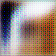</td>
		<td></td>
		<td></td>
		<td></td>
		<td></td>
		<td></td>
		<td></td>
		<td></td>
		<td></td>
		<td></td>
		<td></td>
	</tr>
	<tr>
		<td></td>
		<td></td>
		<td></td>
		<td></td>
		<td></td>
		<td></td>
		<td></td>
		<td></td>
		<td></td>
		<td></td>
		<td></td>
		<td></td>
	</tr>
	<tr>
		<td></td>
		<td></td>
		<td></td>
		<td></td>
		<td></td>
		<td></td>
		<td></td>
		<td></td>
		<td></td>
		<td></td>
		<td></td>
		<td></td>
	</tr>
	<tr>
		<td></td>
		<td></td>
		<td></td>
		<td></td>
		<td></td>
		<td></td>
		<td></td>
		<td>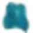</td>
		<td></td>
		<td></td>
		<td></td>
		<td></td>
	</tr>
	<tr>
		<td></td>
		<td></td>
		<td></td>
		<td>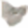</td>
		<td></td>
		<td></td>
		<td></td>
		<td></td>
		<td></td>
		<td>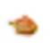</td>
		<td></td>
		<td></td>
	</tr>
	<tr>
		<td></td>
		<td></td>
		<td></td>
		<td></td>
		<td></td>
		<td>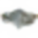</td>
		<td></td>
		<td></td>
		<td></td>
		<td></td>
		<td></td>
		<td></td>
	</tr>
	<tr>
		<td></td>
		<td></td>
		<td></td>
		<td></td>
		<td>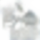</td>
		<td></td>
		<td></td>
		<td></td>
		<td></td>
		<td></td>
		<td>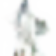</td>
		<td></td>
	</tr>
	<tr>
		<td></td>
		<td></td>
		<td></td>
		<td></td>
		<td></td>
		<td></td>
		<td></td>
		<td></td>
		<td></td>
		<td></td>
		<td></td>
		<td></td>
	</tr>
	<tr>
		<td></td>
		<td></td>
		<td>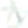</td>
		<td></td>
		<td></td>
		<td></td>
		<td></td>
		<td></td>
		<td></td>
		<td></td>
		<td></td>
		<td></td>
	</tr>
	<tr>
		<td></td>
		<td></td>
		<td></td>
		<td></td>
		<td></td>
		<td></td>
		<td></td>
		<td></td>
		<td></td>
		<td></td>
		<td></td>
		<td></td>
	</tr>
	<tr>
		<td></td>
		<td></td>
		<td></td>
		<td></td>
		<td></td>
		<td></td>
		<td></td>
		<td></td>
		<td></td>
		<td></td>
		<td></td>
		<td></td>
	</tr>
	<tr>
		<td></td>
		<td></td>
		<td></td>
		<td></td>
		<td></td>
		<td></td>
		<td></td>
		<td></td>
		<td></td>
		<td></td>
		<td></td>
		<td></td>
	</tr>
	<tr>
		<td></td>
		<td></td>
		<td>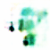</td>
		<td></td>
		<td></td>
		<td></td>
		<td>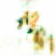</td>
		<td>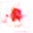</td>
		<td>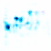</td>
		<td></td>
		<td></td>
		<td></td>
	</tr>
	<tr>
		<td></td>
		<td></td>
		<td></td>
		<td></td>
		<td></td>
		<td></td>
		<td></td>
		<td></td>
		<td></td>
		<td></td>
		<td></td>
		<td></td>
	</tr>
	<tr>
		<td></td>
		<td></td>
		<td></td>
		<td></td>
		<td></td>
		<td></td>
		<td></td>
		<td></td>
		<td></td>
		<td></td>
		<td></td>
		<td></td>
	</tr>
	<tr>
		<td></td>
		<td></td>
		<td></td>
		<td></td>
		<td></td>
		<td></td>
		<td></td>
		<td></td>
		<td></td>
		<td></td>
		<td></td>
		<td></td>
	</tr>
	<tr>
		<td></td>
		<td></td>
		<td></td>
		<td></td>
		<td></td>
		<td></td>
		<td></td>
		<td></td>
		<td></td>
		<td></td>
		<td></td>
		<td></td>
	</tr>
	<tr>
		<td></td>
		<td></td>
		<td></td>
		<td></td>
		<td></td>
		<td></td>
		<td></td>
		<td></td>
		<td></td>
		<td></td>
		<td></td>
		<td></td>
	</tr>
	<tr>
		<td></td>
		<td></td>
		<td></td>
		<td></td>
		<td></td>
		<td></td>
		<td></td>
		<td></td>
		<td></td>
		<td></td>
		<td></td>
		<td></td>
	</tr>
	<tr>
		<td></td>
		<td></td>
		<td></td>
		<td></td>
		<td></td>
		<td></td>
		<td></td>
		<td></td>
		<td></td>
		<td></td>
		<td></td>
		<td></td>
	</tr>
	<tr>
		<td></td>
		<td></td>
		<td></td>
		<td></td>
		<td></td>
		<td></td>
		<td></td>
		<td></td>
		<td></td>
		<td></td>
		<td></td>
		<td></td>
	</tr>
	<tr>
		<td></td>
		<td></td>
		<td></td>
		<td></td>
		<td></td>
		<td></td>
		<td></td>
		<td></td>
		<td></td>
		<td></td>
		<td></td>
		<td></td>
	</tr>
	<tr>
		<td></td>
		<td></td>
		<td></td>
		<td></td>
		<td></td>
		<td></td>
		<td></td>
		<td></td>
		<td></td>
		<td></td>
		<td></td>
		<td></td>
	</tr>
	<tr>
		<td></td>
		<td></td>
		<td></td>
		<td></td>
		<td></td>
		<td></td>
		<td></td>
		<td></td>
		<td></td>
		<td></td>
		<td></td>
		<td></td>
	</tr>
	<tr>
		<td></td>
		<td></td>
		<td></td>
		<td></td>
		<td></td>
		<td></td>
		<td></td>
		<td></td>
		<td></td>
		<td></td>
		<td></td>
		<td></td>
	</tr>
	<tr>
		<td></td>
		<td></td>
		<td></td>
		<td></td>
		<td></td>
		<td></td>
		<td></td>
		<td></td>
		<td></td>
		<td></td>
		<td></td>
		<td></td>
	</tr>
	<tr>
		<td></td>
		<td></td>
		<td></td>
		<td></td>
		<td></td>
		<td></td>
		<td></td>
		<td></td>
		<td></td>
		<td></td>
		<td></td>
		<td></td>
	</tr>
	<tr>
		<td></td>
		<td></td>
		<td></td>
		<td></td>
		<td></td>
		<td></td>
		<td></td>
		<td></td>
		<td></td>
		<td></td>
		<td></td>
		<td></td>
	</tr>
	<tr>
		<td></td>
		<td></td>
		<td></td>
		<td></td>
		<td></td>
		<td></td>
		<td></td>
		<td></td>
		<td></td>
		<td></td>
		<td></td>
		<td></td>
	</tr>
	<tr>
		<td></td>
		<td></td>
		<td></td>
		<td></td>
		<td></td>
	</tr>
</table>

### Discriminator Accuracy
<table>
    <tr>
        <td>Discriminator on real images</td>
    </tr>
    <tr>
        <td></td>
    </tr>
    <tr>
        <td>Discriminator on fake images</td>
    </tr>
    <tr>
        <td></td>
    </tr>
    <tr>
        <td>Discriminator combined mean loss</td>
    </tr>
    <tr>
        <td></td>
    </tr>
</table>

# Analysis

## Case 1

### Loss
<table>
    <tr>
        <td>Generator Loss</td>
    </tr>
    <tr>
        <td>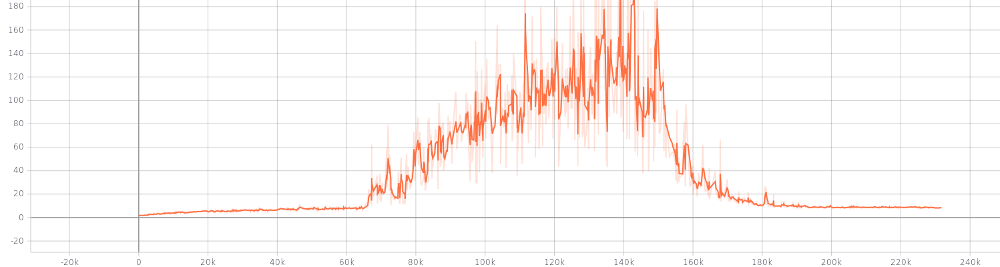</td>
    </tr>
    <tr>
    	<td>Discriminator Loss</td>
    </tr>
    <tr>
        <td>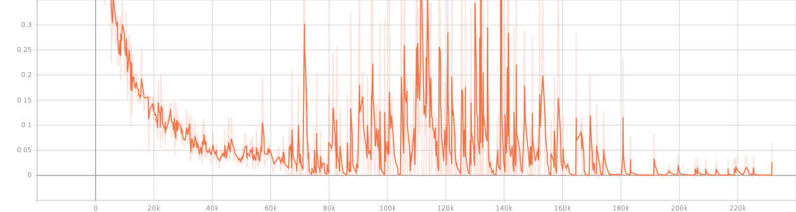</td>
    </tr>
</table>

### Histograms
<table>
    <tr>
        <td>Generator Loss</td>
    </tr>
    <tr>
        <td>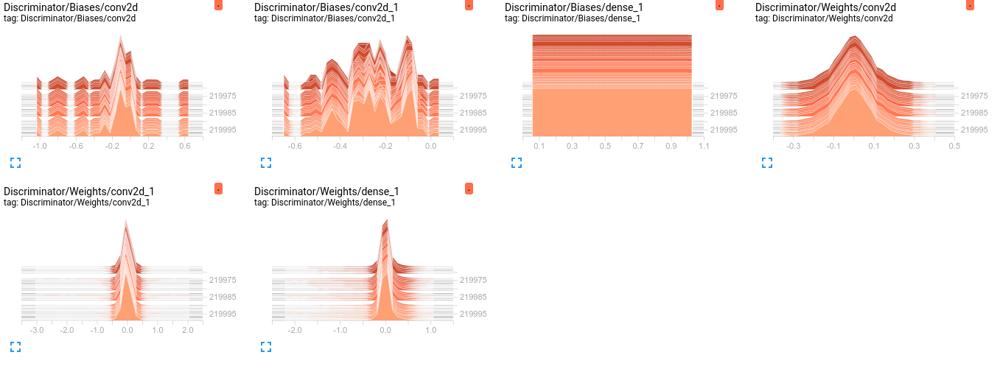</td>
    </tr>
    <tr>
    	<td>Discriminator Loss</td>
    </tr>
    <tr>
        <td>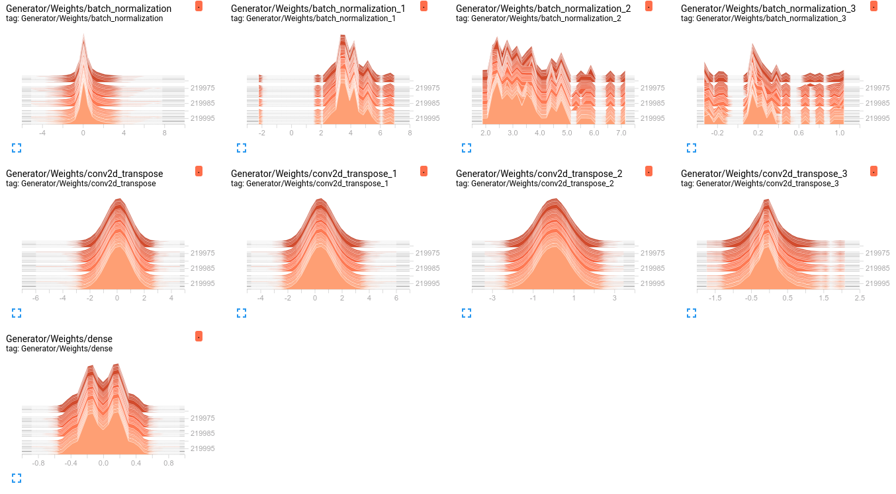</td>
    </tr>
</table>

### Distribution
<table>
    <tr>
        <td>Generator Loss</td>
    </tr>
    <tr>
        <td>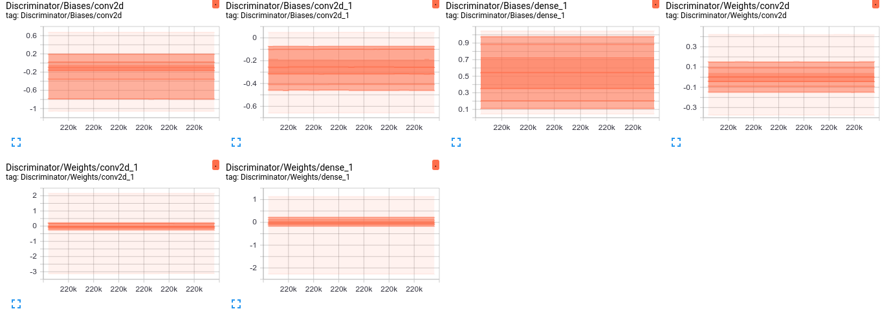</td>
    </tr>
    <tr>
    	<td>Discriminator Loss</td>
    </tr>
    <tr>
        <td>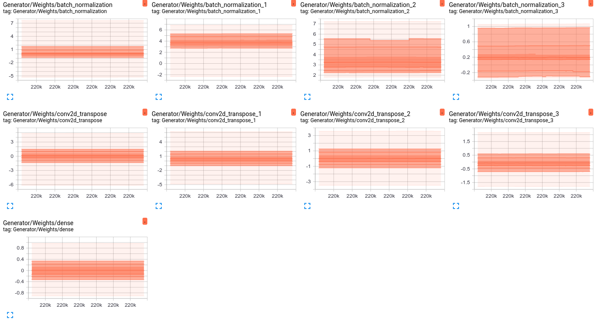</td>
    </tr>
</table>

### Training Speed
<table>
    <tr>
        <td>Sum epoch</td>
    </tr>
    <tr>
        <td></td>
    </tr>
    <tr>
    	<td>Average epoch</td>
    </tr>
    <tr>
        <td></td>
    </tr>
    <tr>
    	<td>Train epoch</td>
    </tr>
    <tr>
        <td></td>
    </tr>
</table>

## Case 2

### Loss
<table>
    <tr>
        <td>Generator Loss</td>
    </tr>
    <tr>
        <td>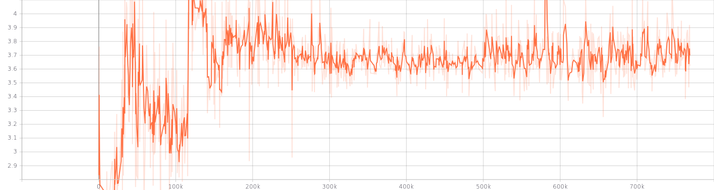</td>
    </tr>
    <tr>
    	<td>Discriminator Loss</td>
    </tr>
    <tr>
        <td>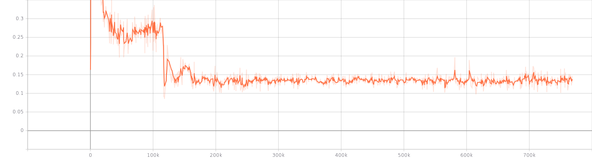</td>
    </tr>
</table>

### Histograms
<table>
    <tr>
        <td>Generator Loss</td>
    </tr>
    <tr>
        <td>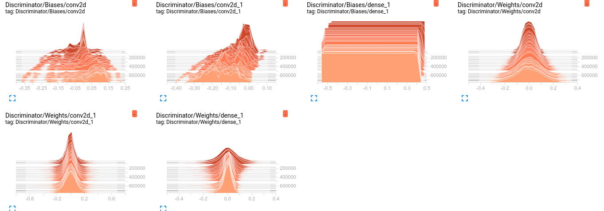</td>
    </tr>
    <tr>
    	<td>Discriminator Loss</td>
    </tr>
    <tr>
        <td>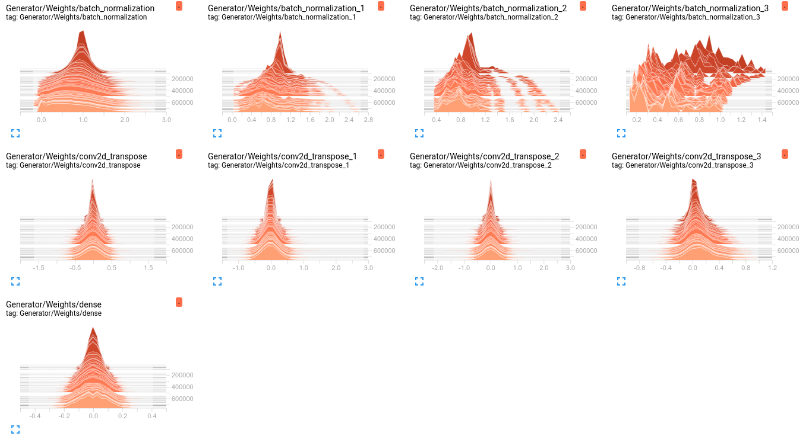</td>
    </tr>
</table>

### Distribution
<table>
    <tr>
        <td>Generator Loss</td>
    </tr>
    <tr>
        <td></td>
    </tr>
    <tr>
    	<td>Discriminator Loss</td>
    </tr>
    <tr>
        <td>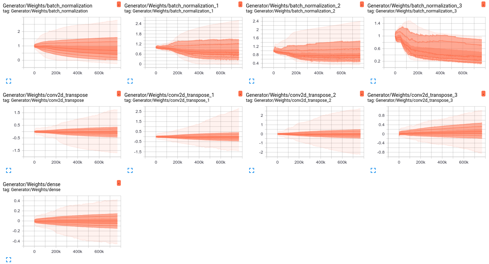</td>
    </tr>
</table>

### Training Speed
<table>
    <tr>
        <td>Sum epoch</td>
    </tr>
    <tr>
        <td></td>
    </tr>
    <tr>
    	<td>Average epoch</td>
    </tr>
    <tr>
        <td></td>
    </tr>
    <tr>
    	<td>Train epoch</td>
    </tr>
    <tr>
        <td></td>
    </tr>
</table>

## Case 3

### Loss
<table>
    <tr>
        <td>Generator Loss</td>
    </tr>
    <tr>
        <td></td>
    </tr>
    <tr>
    	<td>Discriminator Loss</td>
    </tr>
    <tr>
        <td></td>
    </tr>
</table>

### Histograms
<table>
    <tr>
        <td>Generator Loss</td>
    </tr>
    <tr>
        <td></td>
    </tr>
    <tr>
    	<td>Discriminator Loss</td>
    </tr>
    <tr>
        <td></td>
    </tr>
</table>

### Distribution
<table>
    <tr>
        <td>Generator Loss</td>
    </tr>
    <tr>
        <td></td>
    </tr>
    <tr>
    	<td>Discriminator Loss</td>
    </tr>
    <tr>
        <td></td>
    </tr>
</table>

### Training Speed
<table>
    <tr>
        <td>Sum epoch</td>
    </tr>
    <tr>
        <td></td>
    </tr>
    <tr>
    	<td>Average epoch</td>
    </tr>
    <tr>
        <td></td>
    </tr>
    <tr>
    	<td>Train epoch</td>
    </tr>
    <tr>
        <td></td>
    </tr>
</table>